# MOMO — ESP32-S3 Robot Development Board

**WiFi · Bluetooth · AI · Arduino — by Massmore**
`SKU-1020`

<<<<<<< HEAD

  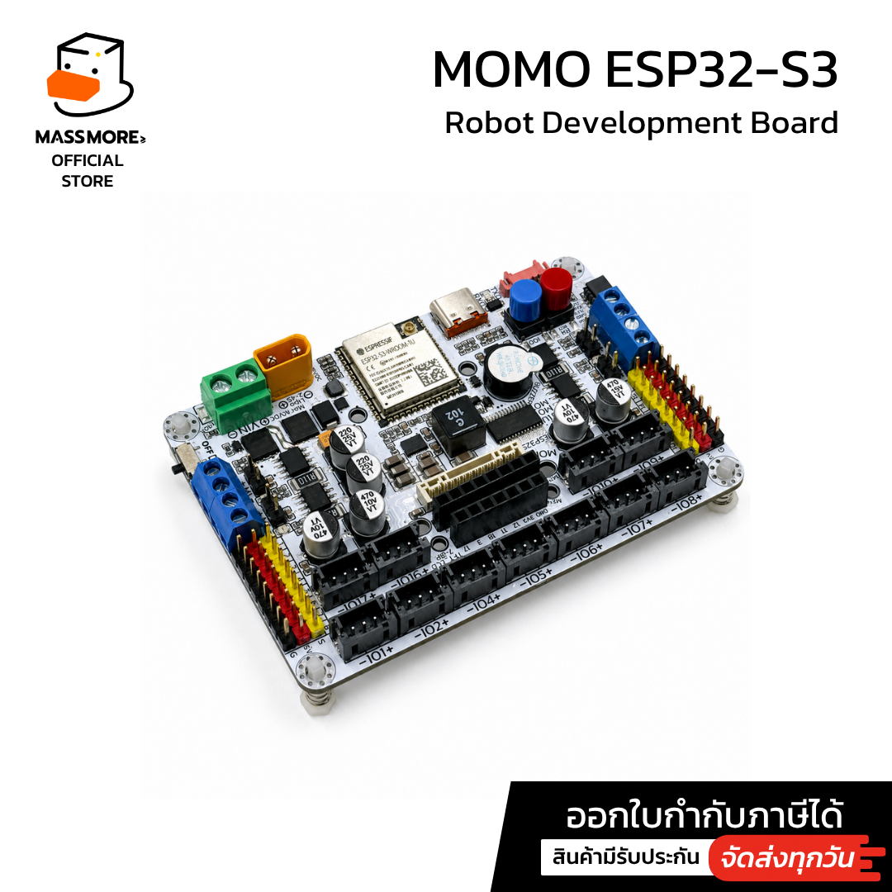

=======
.png)
>>>>>>> 90e7e6ca1f6e356137e47f9b73173bdc861f0fea

> All-in-one robotics development board built around the **Espressif ESP32-S3-WROOM-1U (N16R8)**: a powerful dual-core AIoT MCU, a 4-channel DC-motor driver, a 16-channel servo/PWM driver, an on-board color LCD and robust power management — everything you need to build a Wi-Fi / Bluetooth robot on a single board.

---

## ✨ Features

- 🧠 **ESP32-S3-WROOM-1U (N16R8)** — dual-core LX7 up to 240 MHz, AI vector acceleration
- 💾 **16 MB Flash + 8 MB PSRAM** — large programs, AI models, graphics
- 📶 **Wi-Fi 2.4 GHz 802.11 b/g/n + Bluetooth LE 5** — external antenna (1U)
- ⚙️ **4 × TB67H451AFNG** DC-motor driver — up to ~2.2 A / channel
- 🦾 **16-channel PCA9685** servo / PWM driver (I²C `0x40`)
- 🖥️ **1.3" IPS LCD** — ST7789, 240×240, SPI
- 🔌 **USB-C + CH343P** — up to 6 Mbps, auto-download
- 🛡️ **TPS62162 buck + reverse-polarity protection + XT30** battery input
- 🔔 Active buzzer + user button · 10× ADC/GPIO · I²C / SPI / UART

  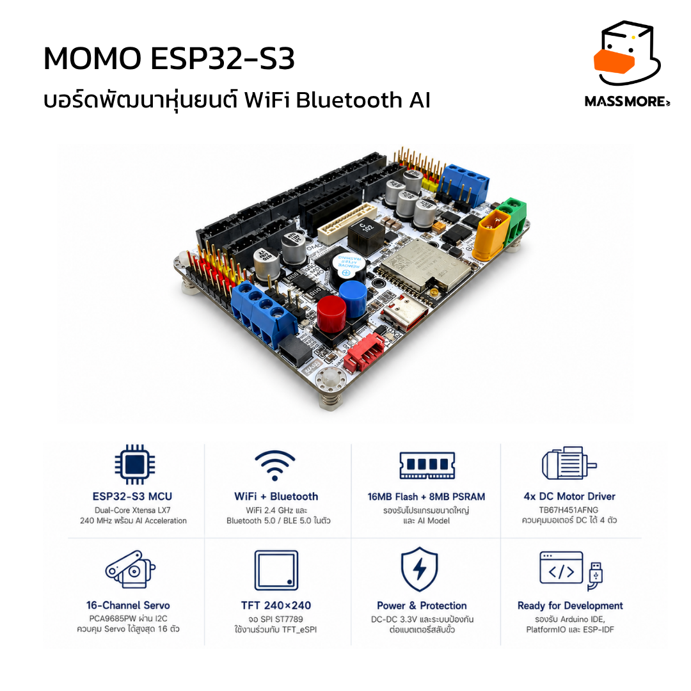

---

## 📂 Repository structure

| Folder | Contents |
|---|---|
| [`01-Arduino-IDE-Setup/`](01-Arduino-IDE-Setup/) | Step-by-step Arduino IDE setup **+ CH343 USB driver install** |
| [`02-Examples/`](02-Examples/) | Beginner → advanced Arduino sketches (one per on-board IC) |
| [`03-Example-Project/`](03-Example-Project/) | Ready-to-run project sketches (touch screen, thermal camera, ECG, gripper …) |
| [`Document/`](Document/) | Datasheets, board photos & pinout diagrams ([`images/`](Document/images/)) |

---

## 🚀 Quick start

1. Install **Arduino IDE 2.x** and the **ESP32 board package** (by Espressif) — see [`01-Arduino-IDE-Setup`](01-Arduino-IDE-Setup/).
2. Install the **CH343 USB driver** if no COM port appears.
3. Select board **"ESP32S3 Dev Module"**, set **PSRAM = OPI** and **Flash = 16 MB**.
4. Open [`02-Examples/01_HelloWorld`](02-Examples/01_HelloWorld/) → **Upload** → open Serial Monitor @ 115200.

> ✅ If the Serial Monitor shows `PSRAM : 8388608 bytes` (8 MB), the **OPI PSRAM** setting is correct and the board is 100 % ready.

---

## 🗺️ Pinout & components

**Component overview (1–20)**

  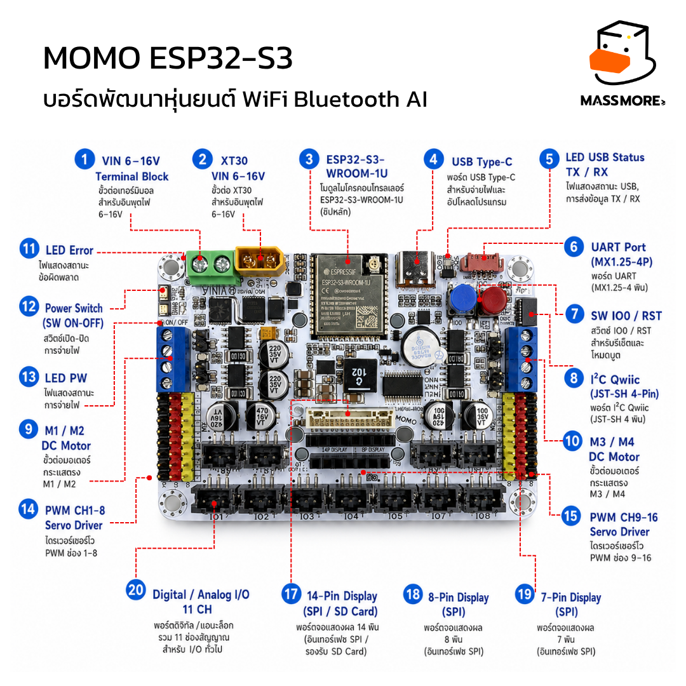

| GPIO Pinout | Motor / Servo / Display Pinout |
|:---:|:---:|
| 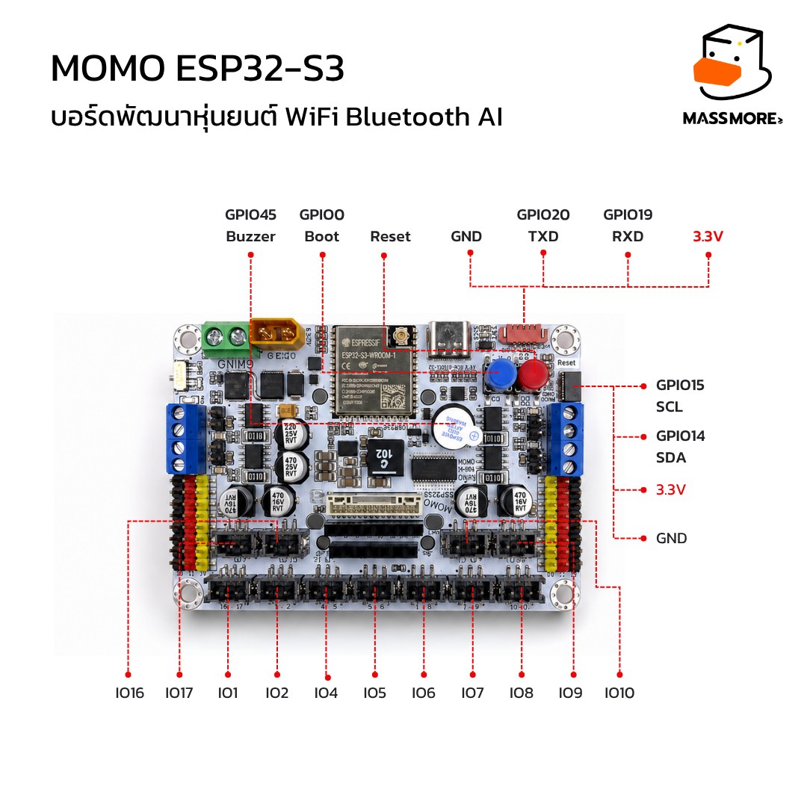 | 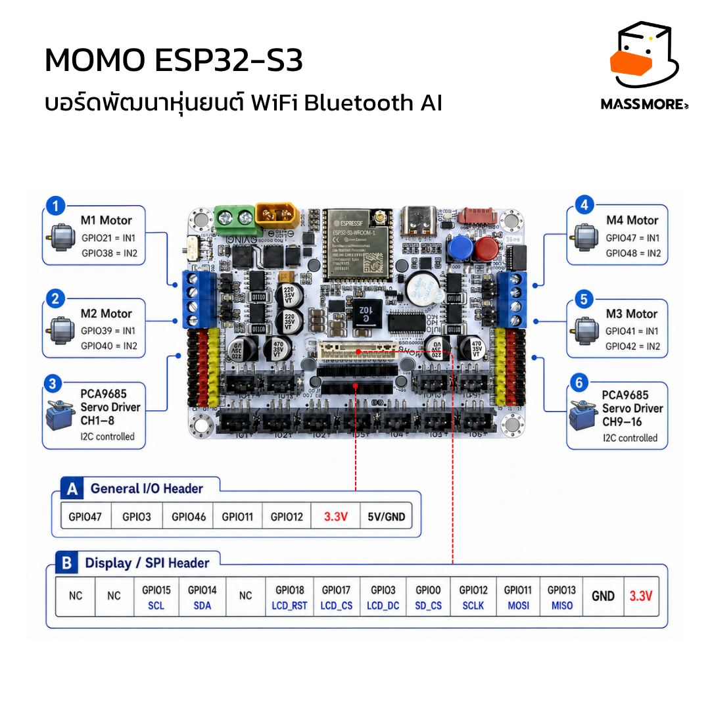 |

### Pin map (firmware-verified)

| Bus / Function | Signal | GPIO |
|---|---|---|
| I²C | SDA / SCL | **14 / 15** |
| SPI | MOSI / MISO / SCLK | **11 / 13 / 12** |
| UART | RXD / TXD | **19 / 20** |
| LCD (ST7789) | CS / DC / RST | **17 / 3 / 18** |
| Motor M1 | EN / PH | **21 / 38** |
| Motor M2 | EN / PH | **39 / 40** |
| Motor M3 | EN / PH | **41 / 42** |
| Motor M4 | EN / PH | **47 / 48** |
| Buzzer | — | **45** |
| User button | — | **0** (BOOT) |
| Servo / PWM | PCA9685 | I²C **0x40**, CH1–16 |
| ADC / GPIO header | IO1–IO11 | 1, 2, 4, 5, 6, 7, 8, 9, 10, 16, 17 |

---

## 📘 Examples

See [`02-Examples/`](02-Examples/) — from **Hello World** to a **4WD robot car**, with one example for every on-board IC.

## 🤖 Projects

See [`03-Example-Project/`](03-Example-Project/) — capacitive touch screen, thermal camera (AMG8833), ECG (AD8232), microphone recorder, SD card, OLED 1.5", servo gripper.

---

## 🖼️ Gallery

| | | |
|:---:|:---:|:---:|
| 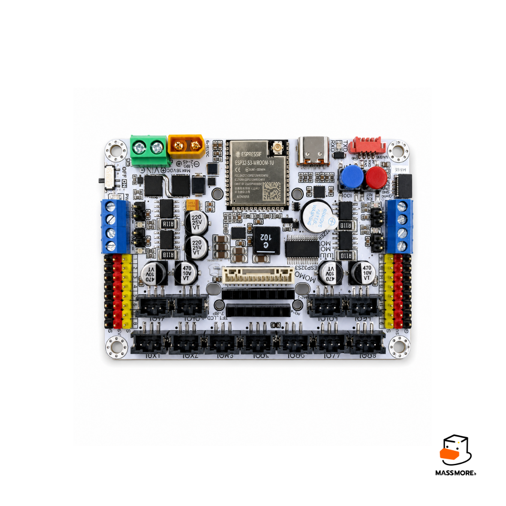 Board (top view) | 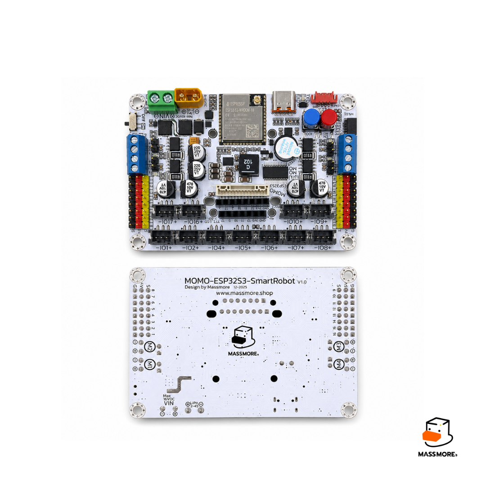 Top & back | 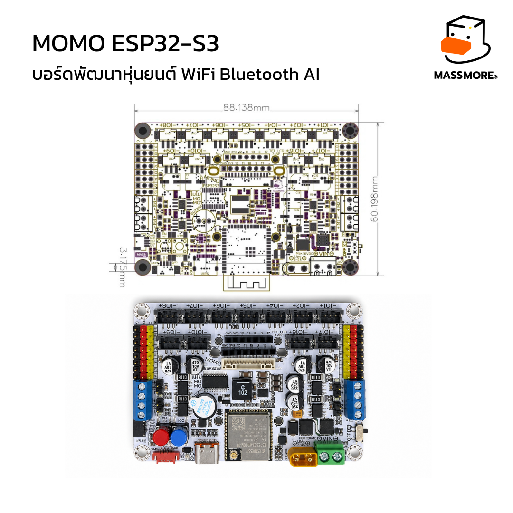 Dimensions |
| 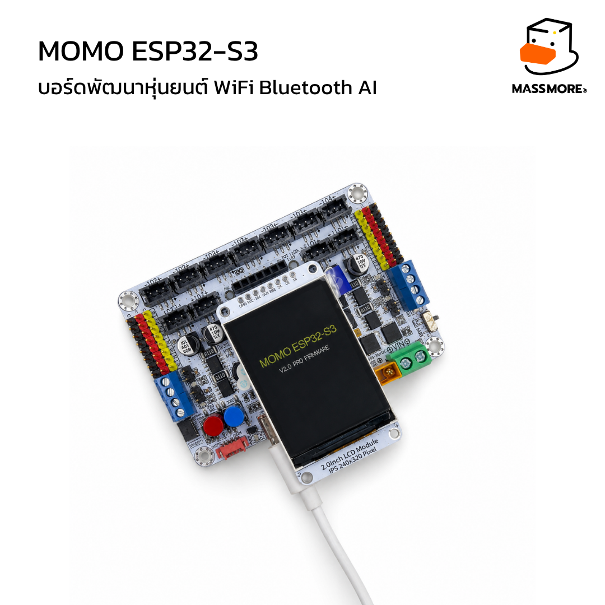 LCD display | 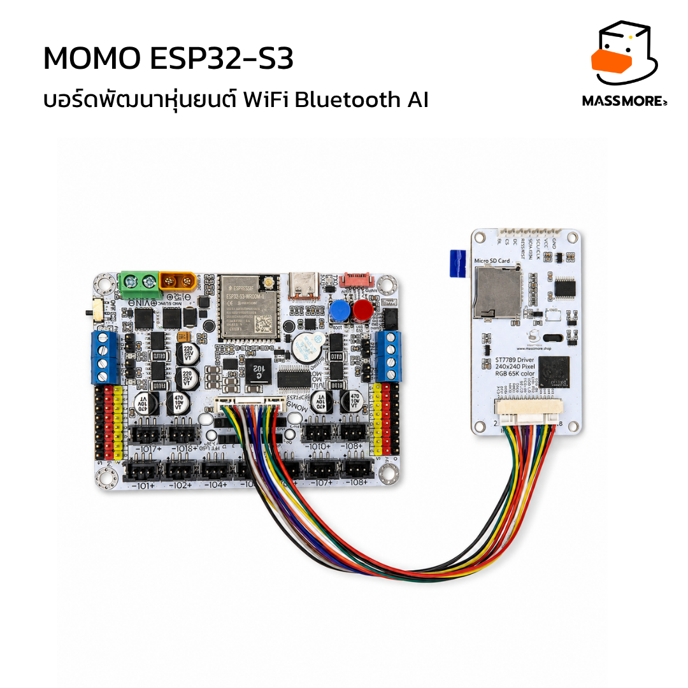 Wiring example | 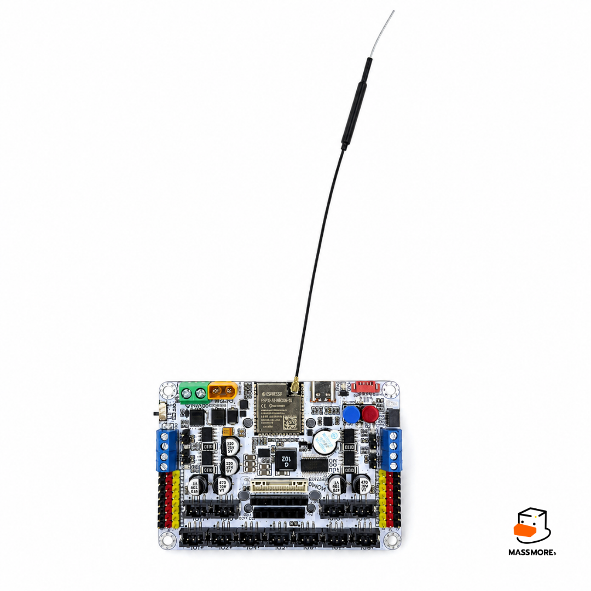 External antenna |

---

## 📚 Resources

- **Arduino-ESP32 docs:** https://docs.espressif.com/projects/arduino-esp32/en/latest/
- **TFT_eSPI:** https://github.com/Bodmer/TFT_eSPI
- **Adafruit PCA9685 lib:** https://github.com/adafruit/Adafruit-PWM-Servo-Driver-Library
- **CH343 driver (WCH):** https://www.wch-ic.com/downloads/CH343SER_EXE.html
- **Datasheets:** ESP32-S3-WROOM-1U · TB67H451AFNG · PCA9685 · CH343 · TPS62162 · ST7789

## 🛒 Store

**[www.massmore.shop](https://www.massmore.shop/)** — © MASSMORE BIZ CO., LTD.
